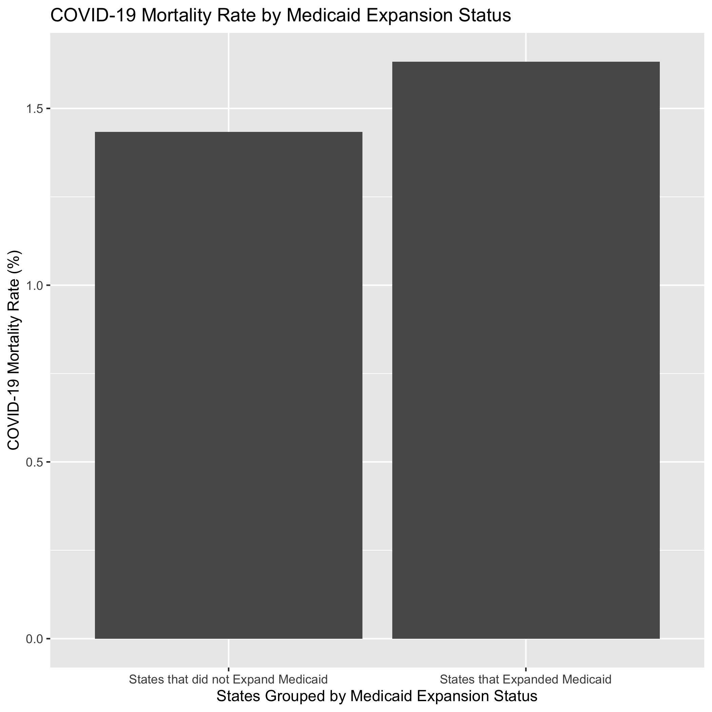
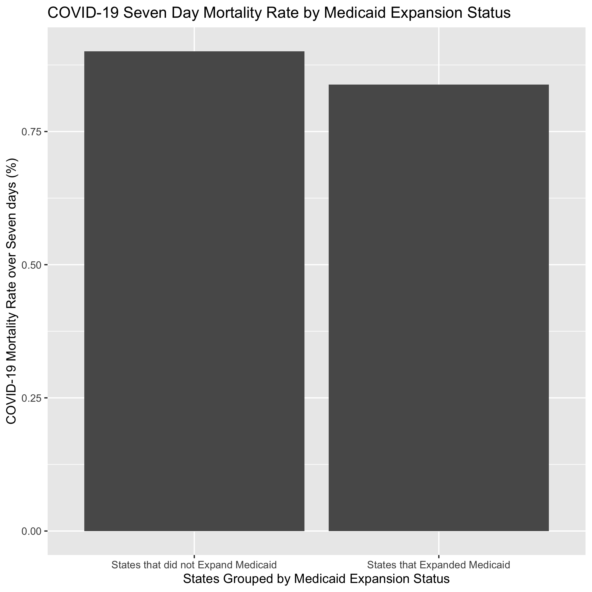

## Exploratory analysis

_We examined differences in mortality rates and 7 day mortality rates between states that expanded medicaid in 2014 and states that did not. Our hypothesis was that there might be a higher death rate in states who that did not expand medicaid due to access to care. The first plot shows the mortality rate for COVID-19 since the beginning of the pandemic to be higher among states who expanded medicaid. The second plot shows the 7 day mortality rate from the the previous week to be higher among those states who did not expand medicaid. _


```{r summarytable,  echo=FALSE}
#resulttable=readRDS("../../results/summarytable.rds")
#knitr::kable(resulttable, caption = 'Data summary table.')
```


Figure \@ref(fig:resultfigure1) shows a bar chart figure produced by one of the R scripts.

```{r resultfigure1,  fig.cap='Analysis figure.', echo=FALSE}

```
Figure \@ref(fig:resultfigure2) shows a bar chart figure produced by one of the R scripts.
```{r resultfigure2,  fig.cap='Analysis figure.', echo=FALSE}

```


